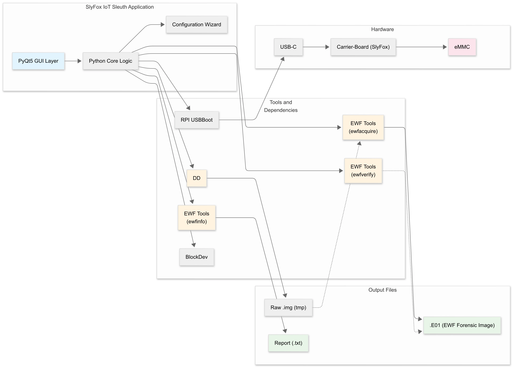
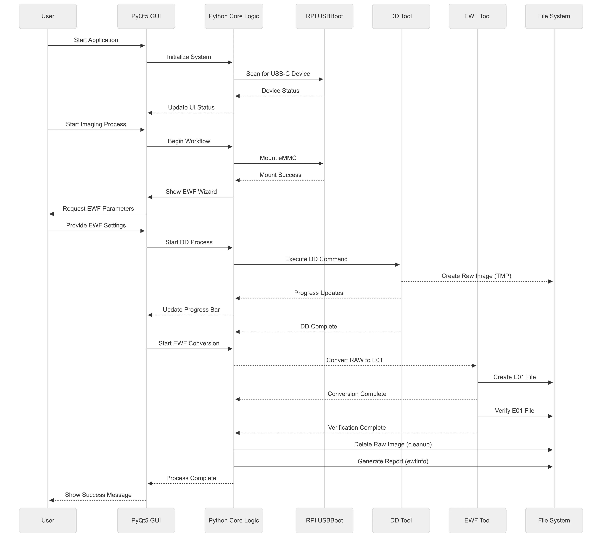
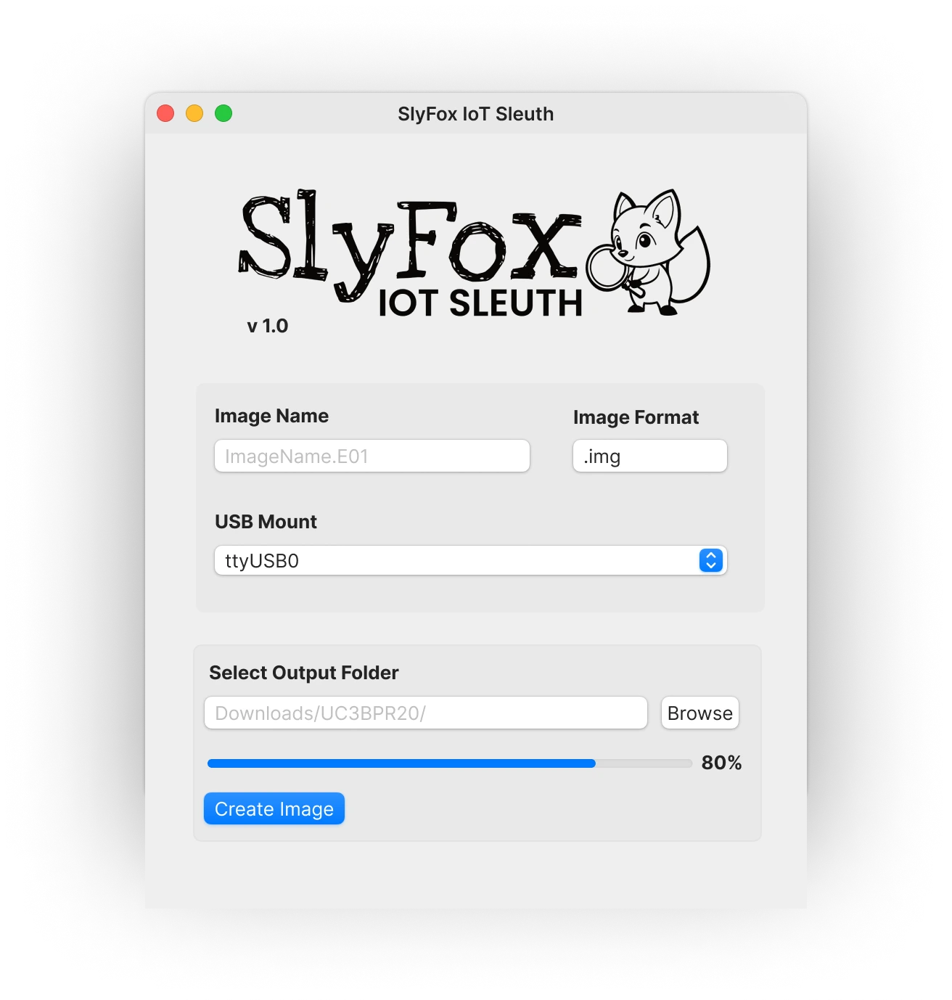

    
    
  
  

    <a href="#about"><strong>About</strong></a>
    ·
    <a href="#download"><strong>Download & Use</strong></a>
    ·
    <a href="#schematic"><strong>Schematic & Layout</strong></a>
    ·
    <a href="#renders"><strong>Renders</strong></a>
    ·
    <a href="#Software"><strong>Software</strong></a>
  

<!-- ABOUT -->

## SlyFox IoT Sleuth 
Part of UC3BPR20 2025 - Acquisition and Analysis of Forensic Artefacts in a Smart Home Environment: A Study in IoT Forensics.

The [SlyFox IoT Sleuth (SFHPCBA01)](https://github.com/oeeve/SlyFox) prototype has been developed as a forensic acquisition tool for Homey Pro (and other RPI CM4-based devices), based on the acquisition process described in [github.com/oeeve/UC3BPR20](https://github.com/oeeve/UC3BPR20).

A comprehensive IoT forensics dataset based on a purpose-built testbed consisting of the Homey Pro (2023), the Homey Android application and a selection of Zigbee sensors and acutators has been made available at [github.com/oeeve/UC3BPR20](https://github.com/oeeve/UC3BPR20) to support future research, training, and testing in IoT forensics.

<figure>
  
  <figcaption>Figure 1: SlyFox IoT Sleuth project deliverables, including the
    <a href="https://github.com/oeeve/UC3BPR20">IoT forensics dataset</a>.</figcaption>
</figure>

&nbsp;

<!-- DOWNLOAD & USE -->

## Download & Use

### Download

| Application  | SHA-256 |
| ----------- | -------------- |
| [-B58DAE?style=flat&logo=download&logoColor=white)](https://github.com/oeeve/UC3BPR20) | `TBA` |

### Installation
**TBA**

### Use
**TBA**

<!-- SCHEMATIC & LAYOUT -->

## Schematic & Layout

### Block Diagram
<figure>
  
  <figcaption>Figur 2: Block diagrams. Left: PCB layout. Right: System diagram.</figcaption>
</figure>

&nbsp;

### Schematic
<figure>
  
  <figcaption>Figure 3: SlyFox IoT Sleuth (SFHPCBA01) carrier board for CM4. Based on reference design from <a href="https://datasheets.raspberrypi.com/cm4io/cm4iousb3-appnote.pdf">CM4IO</a>.</figcaption>
</figure>

&nbsp;

#### Bill of Materials

| ID     | Model                   | Description                                                                                                                                          | DS  |
| ------ | ----------------------- | ---------------------------------------------------------------------------------------------------------------------------------------------------- | --- |
| P1,P2  | DF40C-100DS-0.4V(51)    | Hirose 100-pin connectors, used by the CM4.                                                                                                          | [1] |
| J1     | TE 2345986-1            | USB-C connector to interface with host / lab PC.                                                                                                     | [2] |
| SW1    | CL-SB-12B               | Latching-switch to pull \texttt{nRPIBOOT} to ground and force eMMC USB boot.                                                                         | [3] |
| R1,R2,R3  | CRCW06031K00FKEAC    | 0603 1K resistors.                                                                                                                                   | [4] |
| R4,R5  | CRCW06035K11FKEAC       | 0603 5k1 pulldown resistors. Set to keep CC1 and CC2 on J1 permanent low. This configuration defines J1 as a device-only, USB 2.0 only interface.    | [5] |
| C1     | 6SVPC330M               | 330 µF electrolyte PHA capacitor. Inrush protection and bulk decoupling on VBUS, required on USB downstream devices.                                 | [6] |
| U1,U2  | 74LVC1G07               | Open drain and voltage-level controller. When `PI_LED_nPWR` is low, it will pull to ground and activate LED 1 / 2.                                   | [7] |
| LED1   | 150060RS75000           | 0603 LED. Connected to U1 and `PI LED nPWR` CM4's power signal. Lights red when CM4 is powered on.                                                   | [8] |
| LED2   | 150060VS75000           | 0603 LED. Connected to U2 and `PI nLED Activity` CM4's storage access indicator, blinking green when the eMMC is read or written to.                 | [9] |
| LED3   | 150060VS75000           | 0603 LED. Connected to ground through SW1, and lights green when \texttt{nRPIBOOT} is pulled low, thus set in USB boot mode.                         | [9] |

[1]: https://www.hirose.com/product/p/CL0684-4033-4-51
[2]: https://www.te.com/en/product-2345986-1.html
[3]: https://www.digikey.com/en/products/detail/vishay-dale/CRCW06031K00FKEAC/7928371
[4]: https://www.digikey.com/en/products/detail/vishay-dale/CRCW06035K11FKEAC/7924012
[5]: https://industrial.panasonic.com/ww/products/pt/os-con/models/6SVPC330M
[6]: https://www.ti.com/lit/ds/symlink/sn74lvc1g07.pdf
[7]: https://www.farnell.com/datasheets/4410072.pdf
[8]: https://www.digikey.no/no/products/detail/w%C3%BCrth-elektronik/150060RS75000/4489901
[9]: https://www.digikey.no/no/products/detail/w%C3%BCrth-elektronik/150060VS75000/4489906
 

### PCB Layout
<figure>
  
  <figcaption>Figure 4: PCB - Top.</figcaption>
</figure>
 
&nbsp;

<!-- RENDERS -->

## PCB Renders

<figure>
  
  <figcaption>Figure 5: PCBA - Top and Front.</figcaption>
</figure>
 
&nbsp;

<figure>
  
  <figcaption>Figure 6: PCBA - Isometric.</figcaption>
</figure>

&nbsp;

<figure>
  
  <figcaption>Figure 7: PCBA + CM4 - Side.</figcaption>
</figure>

&nbsp;

<figure>
  
  <figcaption>Figure 8: PCBA + CM4 - Isometric.</figcaption>
</figure>

&nbsp;

<!-- SOFTWARE -->

## Software

**TBA**

<figure>
  
  <figcaption>Figure 9: SlyFox Software - Flowchart.</figcaption>
</figure>

&nbsp;

<figure>
  
  <figcaption>Figure 10: SlyFox Software - Sequence diagram.</figcaption>
</figure>

&nbsp;

<figure>
  
  <figcaption>Figure 11: App concept (GUI).</figcaption>
</figure>

&nbsp;

---

(<a href="#readme-top">back to top</a>)

`Until next time...`
 

  